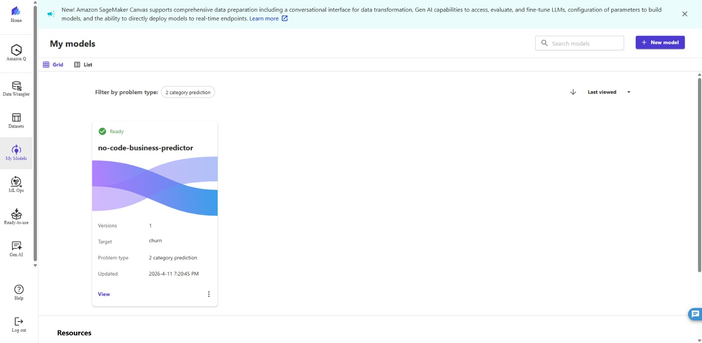
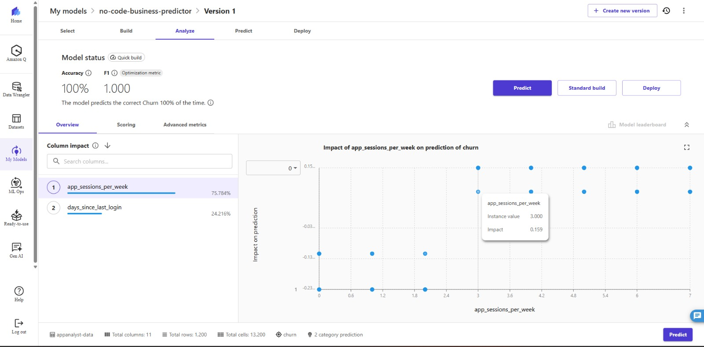
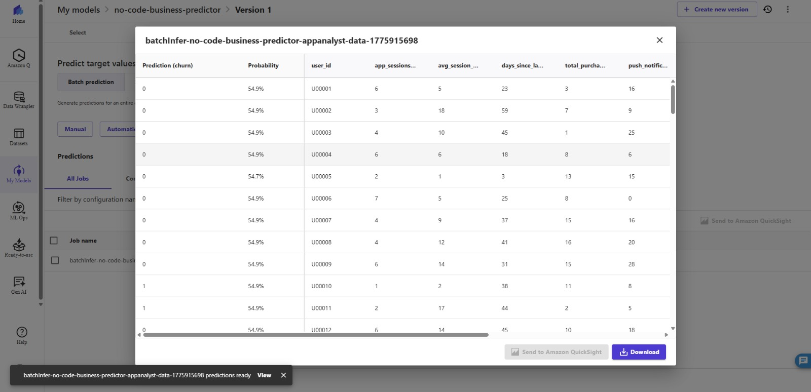
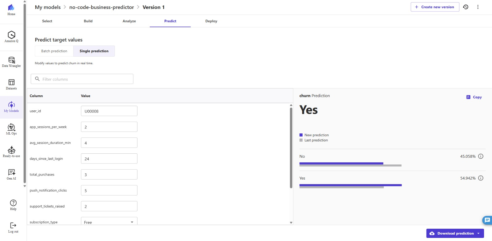
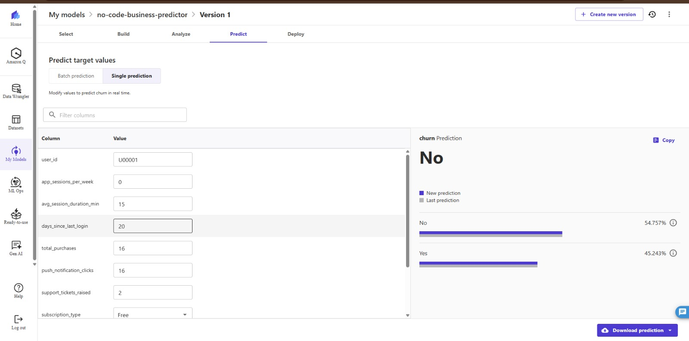
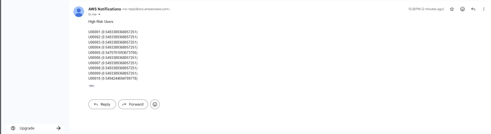

# No-Code Churn Prediction System

A no-code machine learning project built using AWS SageMaker Canvas to predict customer churn and automate high-risk user alerts.

---

## 📌 Project Overview

The **No-Code Churn Prediction System** is an end-to-end machine learning project developed using **AWS SageMaker Canvas** to identify users who are likely to discontinue using a mobile application or digital platform. The project focuses on transforming raw user behavioral data into actionable business insights through predictive analytics and cloud automation.

The system analyzes structured user activity data such as:
- App sessions per week
- Average session duration
- Days since last login
- Total purchases
- Push notification interactions
- Subscription type
- Support tickets raised

Using this data, a **binary classification model** was built in SageMaker Canvas through AWS AutoML capabilities without writing traditional machine learning code. The model predicts whether a user is likely to churn (“Yes”) or remain active (“No”), along with probability-based confidence scores.

The project supports both:
- **Batch Predictions** → analyzing multiple users simultaneously
- **Real-Time Predictions** → analyzing individual users dynamically

Prediction outputs are securely stored in **Amazon S3**, enabling scalable cloud storage and integration with downstream AWS services.

To automate business response workflows, **AWS Lambda** was integrated to process prediction outputs and identify high-risk churn users automatically. Once risky users are detected, **Amazon SNS (Simple Notification Service)** sends automated email alerts to stakeholders, enabling proactive customer retention strategies.

This project demonstrates how cloud-native no-code machine learning solutions can be combined with automation services to build scalable, intelligent, and business-oriented predictive systems.

---

## 🚀 Features
- Batch churn prediction
- Real-time single-user prediction
- Feature impact analysis
- Automated email alerts using SNS
- Scalable cloud-based workflow

---

## ☁️ AWS Services Used
- Amazon SageMaker Canvas
- Amazon S3
- AWS Lambda
- Amazon SNS
- AWS IAM

---

## 🏗️ System Architecture Flow

```text
Local Dataset / User Behavioral Data
                │
                ▼
       Amazon SageMaker Canvas
     (Data Preparation & AutoML)
                │
                ▼
      Churn Prediction Model
   (Binary Classification Model)
                │
      ┌─────────┴─────────┐
      ▼                   ▼
Batch Predictions    Real-Time Predictions
(Multiple Users)      (Single User)
      │                   │
      └─────────┬─────────┘
                ▼
        Prediction Results
                │
                ▼
          Amazon S3 Bucket
      (Stores Prediction Data)
                │
                ▼
          AWS Lambda Trigger
   (Processes High-Risk Users)
                │
                ▼
            Amazon SNS
    (Automated Email Alerts)
                │
                ▼
         Business Stakeholders
   (Retention & Decision Making)
```

## 📊 Model Capabilities
- Binary classification model
- Predicts churn probability
- Supports batch and real-time predictions
- Automated risk notification system

---

## 🎯 Business Impact
The project provides significant business value by helping organizations proactively identify customers who are at risk of leaving before actual churn occurs.

### Key Business Benefits:
- Improves customer retention through early churn detection
- Enables data-driven decision making using predictive analytics
- Reduces revenue loss caused by customer drop-off
- Automates alerting and monitoring workflows
- Minimizes dependency on specialized ML engineering teams
- Supports scalable analysis for large user datasets
- Helps businesses optimize marketing and retention campaigns
- Reduces operational effort through serverless automation
- Demonstrates cost-effective cloud-based ML implementation

By combining machine learning predictions with real-time cloud automation, the system converts raw behavioral data into meaningful business actions, enabling organizations to respond faster and improve long-term customer engagement.

---

## 📷 Project Screenshots

### 🔹 Model Overview


### 🔹 Feature Importance Analysis


### 🔹 Batch Prediction


### 🔹 Real-Time Prediction (High Churn Risk)


### 🔹 Real-Time Prediction (Low Churn Risk)


### 🔹 Automated SNS Email Alert


are available in the `screenshots/` folder.

---

## 👨‍💻 Author
Caren Victor
